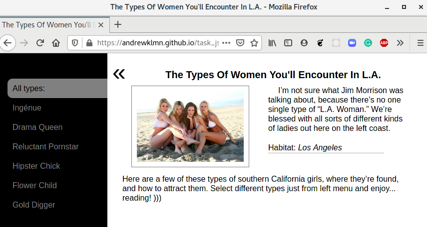

## Document Object Model

Practical task: Implement interactive side-menu' site without page reloads.

Main goal - menu with ability to load some predefined html content related to own menu item into right-positioned <main> content container.

[Demo is here](https://andrewklmn.github.io/task_js_dom/)

[Code is here](https://github.com/andrewklmn/frontend-2021-homeworks/tree/task_js_dom/submissions/andrewklmn/task_js_dom)
